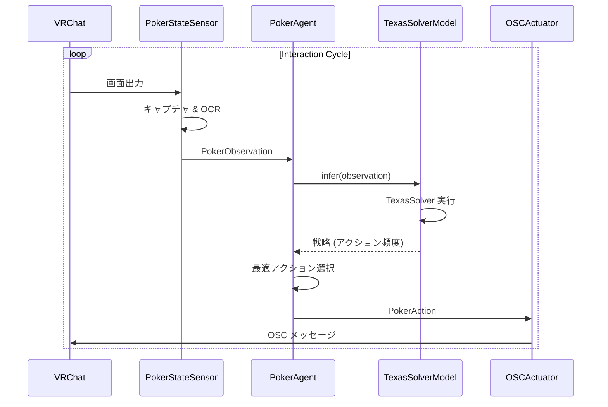

# システムアーキテクチャ

このドキュメントは、`pamiq-core` を基盤とする **VRChat Poker GTO Agent** の構成を説明します。

## 基本概念

システムは `pamiq-core` が定義する **Agent-Environment-Interaction** パターンに厳密に従います。

### 1. エージェント（`PokerAgent`）
- **役割**: 意思決定を担う主体。
- **実装**: `src/poker_gto/agents/poker_agent.py`
- **責務**:
    - 環境から `PokerObservation` を受け取る。
    - `TexasSolverModel`（`InferenceWrappedModel`）で GTO 戦略を計算する。
    - 戦略に基づき最適な `PokerAction` を選択する。

### 3. インタラクション
- **役割**: エージェントと環境を接続する連続ループ。
- **仕組み**: `pamiq-core` がスレッドと同期を管理し、リアルタイム性能を確保する。

## データフロー

システムは **pamiq-core** の **Agent-Environment-Interaction** ループに基づいて構築されています。



## ディレクトリ構成

`pamiq-core` のコンポーネント設計を反映したプロジェクト構造:

```
src/poker_gto/
├── agents/         # エージェント実装
├── environments/   # 環境・センサー・アクチュエーター実装
├── models/         # InferenceWrappedModel 実装（TexasSolver ラッパー）
├── data/           # データクラス（オブザベーション・アクション）
└── launch.py       # エントリーポイント
```
