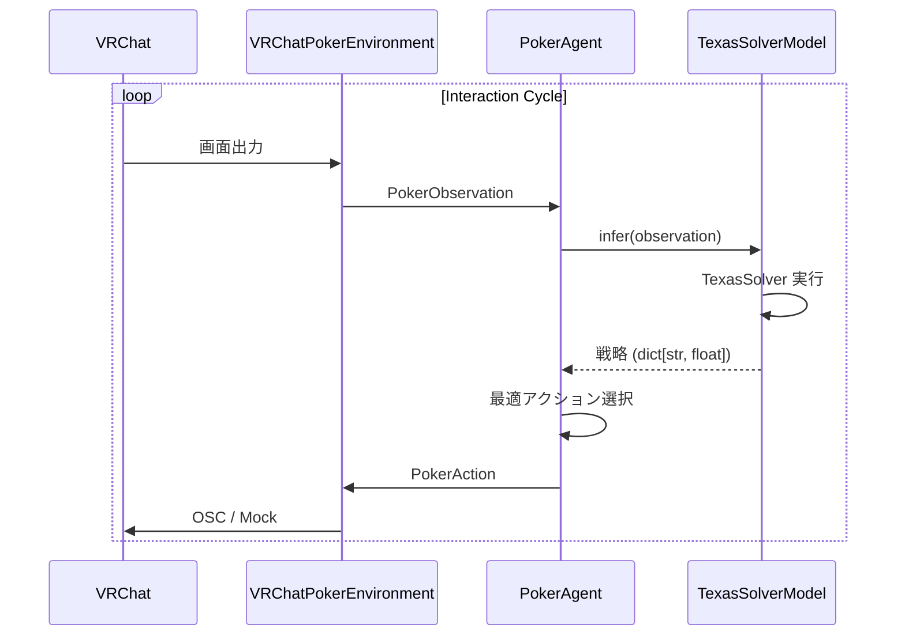

# システムアーキテクチャ

**pamiq-core** を基盤とする VRChat Poker GTO Agent の構成。

## 基本概念

システムは `pamiq-core` が定義する **Agent-Environment-Interaction** パターンに厳密に従います。

### コンポーネント

#### 1. エージェント（`PokerAgent`）
- **実装**: `src/poker_gto/agents/poker_agent.py`
- **責務**:
    - 環境から `PokerObservation` を受け取る
    - `TexasSolverModel` で GTO 戦略を計算
    - 最適な `PokerAction` を選択

#### 2. モデル（`TexasSolverModel`）
- **実装**: `src/poker_gto/models/texassolver.py`
- **責務**:
    - `InferenceModel` インターフェースを実装
    - TexasSolver CLI をラップして GTO 戦略を計算

#### 3. 環境（`VRChatPokerEnvironment`）
- **実装**: `src/poker_gto/environments/vrchat_poker.py`
- **責務**:
    - VRChat からの観測（pamiq-vrchat 使用時）
    - VRChat への操作送信
    - モックモード対応（pamiq-vrchat なし）

## データフロー



## ディレクトリ構成

```
src/poker_gto/
├── agents/         # エージェント実装
├── actuators/      # マウスアクチュエーター（Clicker）
├── data/           # データクラス（Observation/Action）
├── environments/   # 環境実装
├── models/         # InferenceModel 実装
├── vision/         # 画像認識モジュール
│   ├── ocr.py              # EasyOCR エンジン
│   ├── card_detector.py    # カード検出
│   ├── button_detector.py  # ボタン座標検出
│   └── table_parser.py     # ポット・スタック認識
└── launch.py       # エントリーポイント
```

## 設計原則

1. **最小構成**: src を最小限に保ち、pamiq-* パッケージを最大活用
2. **pamiq-core準拠**: Agent-Environment-Interaction パターンに厳密に従う
```
